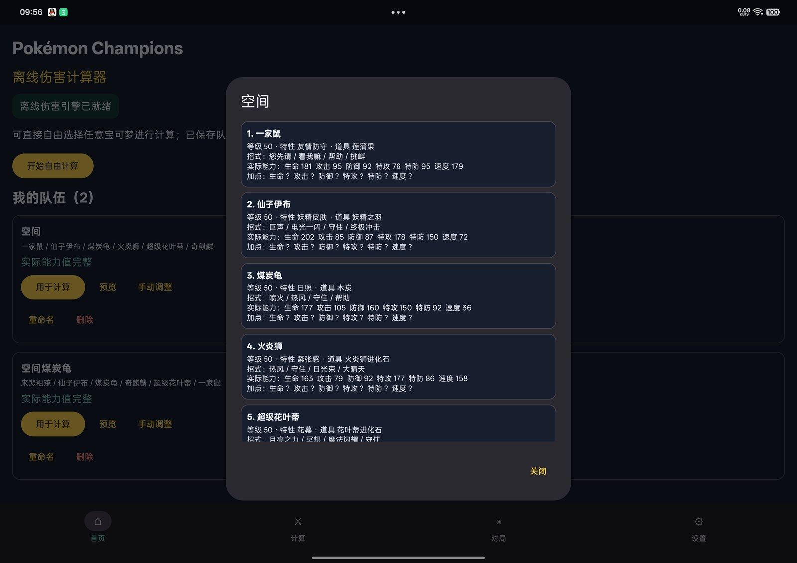
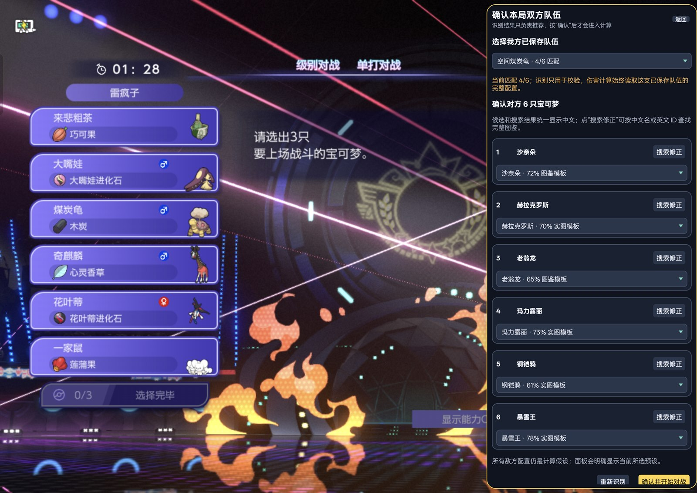
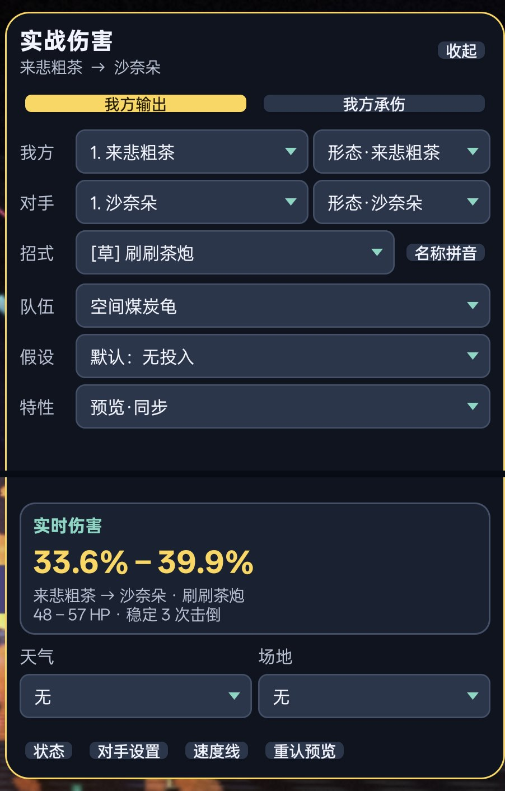

# Pokémon Champions Assistant（非官方）

<p align="center">
  面向 Android 的本地截图识别与实战伤害计算助手
</p>

<p align="center">
  <a href="https://github.com/crazylei12/Pokemon-Champions-dmg_cal/releases/latest"></a>
  
  
  <a href="https://github.com/crazylei12/Pokemon-Champions-dmg_cal/actions/workflows/ci.yml"></a>
  <a href="LICENSE"></a>
</p>

Pokémon Champions Assistant 是一款原生 Android 对战辅助应用。它通过用户主动授权的屏幕截图，在本机识别队伍信息、保存我方完整配置，并以悬浮面板提供双方伤害范围、击倒次数和速度线等结果。

识别、队伍存储和伤害计算均在设备本地完成。项目不会修改、注入或 Hook 游戏进程，不读取游戏内存，不拦截游戏网络，也不会自动操作游戏。

> 本项目与 Nintendo、Creatures、GAME FREAK、The Pokémon Company 或 Pokémon Champions 官方无关。自动识别结果必须由用户确认，计算中的对方配置属于战术假设，不应视为对手真实配置或官方赛事裁定。

## 核心功能

### 1. 识别并保存我方队伍配置

依次全屏打开同一支队伍的“招式 / 道具”页和“能力值”页，通过悬浮按钮各识别一次。应用会把两页结果合并为可复用的本地队伍：

- 6 只宝可梦与形态；
- 特性、道具和招式；
- 等级、实际能力值及能力修正信息；
- 识别后的人工修正、命名、保存与切换。

保存后无需在每局对战中重复录入我方配置，伤害计算会直接读取用户确认过的完整队伍。



### 2. 识别并确认本局双方队伍

在双方队伍预览画面点击“识别当前屏幕上的双方队伍”，应用会一次读取双方各 6 个槽位：

- 我方识别结果用于匹配已有保存队伍；
- 对方每个槽位给出候选和置信度；
- 支持展开 Top-3 候选或按名称搜索修正；
- 只有用户确认后，结果才会进入本局伤害面板。



### 3. 悬浮实战伤害面板

确认本局双方队伍后，可直接在游戏或相册演示画面上打开悬浮伤害面板。面板支持：

- “我方输出”和“我方承伤”双向计算；
- 双方宝可梦、形态、招式、特性、道具与常用配置切换；
- 天气、场地、状态和对手条件调整；
- 伤害百分比、HP 区间、击倒次数与速度线展示；
- 手动锁定选择，避免后续识别静默覆盖正在查看的结果。

<p align="center">
  
</p>

以上均为 Android 平板上的实际运行画面。队伍预览图来自本地相册，仅用于展示用户主动授权、识别和确认的完整流程；画面中的游戏名称、角色与素材权利归各自权利人所有，不属于本项目 MIT License 的授权范围。

## 使用流程

1. 在“对局”页授予悬浮窗权限，并启动用户授权的屏幕截图会话。
2. 首次使用或更换队伍时，识别两张我方队伍配置页，检查结果后命名保存。
3. 进入双方队伍预览画面，点击悬浮按钮识别双方 6 只宝可梦并人工确认。
4. 打开“实战伤害”，选择攻防方向、招式和战斗条件，查看实时结果。

截图会话是 Android 的前台 MediaProjection 会话。应用被强制退出、重新安装或会话被系统终止后，必须由用户再次授权；应用不会在后台静默恢复截图权限。

## 安装

### 下载正式版

1. 打开 [Latest Release](https://github.com/crazylei12/Pokemon-Champions-dmg_cal/releases/latest)。
2. 下载文件名包含 `arm64` / `arm64-v8a` 的 APK。
3. 在 Android 13 或更高版本的 64 位 ARM 手机、平板上安装。

项目当前只发布 `arm64-v8a` APK，不提供 universal、32 位 ARM 或 x86/x86_64 安装包。后续更新可在应用“设置”页手动选择稳定版或预览版频道并检查；APK 下载和安装仍由系统浏览器与 Android 安装器确认。

### 截图识别注意事项

- 选择“单个应用”共享时，请选中当前要识别的 Pokémon Champions 或相册；切换到另一个应用后需要重新授权。
- 识别前应让目标画面稳定并保持全屏，隐藏相册工具栏和会压缩画面的系统控件。
- ColorOS 若提示“应用内容已屏蔽”或“相册内容对方不可见”，请先在通知面板点击“解除屏蔽”。
- 游戏界面布局发生变化、画面处于切换动画或识别置信度较低时，请使用候选列表或搜索手动修正。

完整说明见 [Android 双方队伍 ROI 识别功能说明](docs/android_team_preview_roi_usage_zh.md)。

## 隐私与安全边界

| 项目 | 行为 |
| --- | --- |
| 屏幕内容 | 仅在用户启动 MediaProjection 并点击悬浮按钮后读取当前帧 |
| 识别与计算 | 完全在 Android 本机离线完成 |
| 队伍与对局 | 保存在应用私有目录，不写入公共下载目录 |
| 网络访问 | 仅在用户手动检查更新时访问 GitHub；不上传截图、队伍或计算数据 |
| 游戏交互 | 不注入、不 Hook、不读内存、不拦截网络、不自动点击或代打 |
| 自动识别 | 只提供候选；关键结果由用户确认或修正 |

## 从源码构建

需要 Git、Node.js 22+、npm、JDK 17 和 Android SDK 36。在 Windows PowerShell 中：

```powershell
git clone --recurse-submodules https://github.com/crazylei12/Pokemon-Champions-dmg_cal.git
cd Pokemon-Champions-dmg_cal
npm.cmd ci
npm.cmd ci --prefix external/smogon-damage-calc
npm.cmd ci --prefix external/smogon-damage-calc/calc
npm.cmd test

npm.cmd run android:setup
npm.cmd run android:doctor
npm.cmd run android:assemble
```

Debug APK 输出到：

```text
android-app/app/build/outputs/apk/debug/app-arm64-v8a-debug.apk
```

Release 构建还需要仓库外保存的固定签名密钥。版本、签名、ABI、许可证资产和更新权限的完整发布约定见 [Android 版本与发布指南](docs/android_update_release_guide_zh.md)。

### 识别素材边界

公开源码不跟踪个人截图、保存队伍、标注数据集、下载的第三方图片、原始模板或由这些图片生成的识别特征包。干净克隆仍可构建和使用手动伤害计算、队伍管理、我方队伍 OCR 与悬浮流程；如果要在自己的源码构建中启用队伍预览头像匹配，开发者必须先准备有权使用的本地语料，再生成 `team-preview-templates-v2.bin`。

```powershell
python -m pip install -r requirements-recognition.txt
npm.cmd run recognition:android:templates
```

缺少该特征包不会阻止 Android 构建，但队伍预览头像匹配会提示资源缺失。请勿向 Issue 或 Pull Request 提交个人截图、游戏资源、识别缓存或无再分发授权的数据集。

## 项目结构

```text
android-app/                    Android 应用、悬浮服务、截图、存储与界面
src/damage/                     伤害请求、结果契约与 Smogon 适配层
src/recognition/                ROI、OCR 与识别数据契约
src/data/                       本地化、伤害预设、ROI 配置与来源元数据
tools/android/                  Android 资源构建、环境检查与回归测试
tools/recognition/              本地识别评估与模板生成工具
external/smogon-damage-calc/    固定提交的上游 Git 子模块
```

伤害引擎基于固定版本的 Smogon damage-calc，并通过生成脚本转换为 Android 本地资源。`npm.cmd test` 会执行 TypeScript 检查、Android 伤害引擎与悬浮面板回归测试，以及第三方许可证一致性检查；GitHub Actions 会在提交和 Pull Request 上运行同一质量门槛。

## 文档

- [产品需求与功能边界](docs/pokemon_champions_damage_assistant_prd_zh.md)
- [Android 双方队伍 ROI 识别功能说明](docs/android_team_preview_roi_usage_zh.md)
- [伤害计算设计](docs/damage_calculation_design_zh.md)
- [对局状态与用户调整](docs/battle_state_and_user_adjustment_zh.md)
- [Android 版本、更新与发布指南](docs/android_update_release_guide_zh.md)
- [公开发布检查清单](PUBLIC_RELEASE_CHECKLIST.md)

## 贡献

欢迎通过 Issue 报告可复现问题，或通过 Pull Request 改进代码、测试和文档。提交前请：

1. 运行 `npm.cmd test`；
2. 保持 Smogon 子模块固定在经过审阅的提交；
3. 不提交 APK、签名文件、设备信息、个人队伍、未经审阅的截图或第三方素材；
4. 对新增依赖、数据和生成资源补充来源与许可证说明。

## 许可证与声明

本项目有权许可的原创代码采用 [MIT License](LICENSE)，版权所有者为 `crazylei12`。第三方软件、数据、商标和素材继续受各自许可证与权利约束；完整归属信息见 [THIRD_PARTY_NOTICES.md](THIRD_PARTY_NOTICES.md) 和 `third_party/licenses/`。

Pokémon、Pokémon Champions 及相关名称、角色、图像和商标属于各自权利人。本项目是独立的非官方工具，不获得也不暗示任何官方认可。README 中的实机截图仅用于说明兼容性和功能，不授予对其中第三方素材的复制、再分发或商业使用权。
