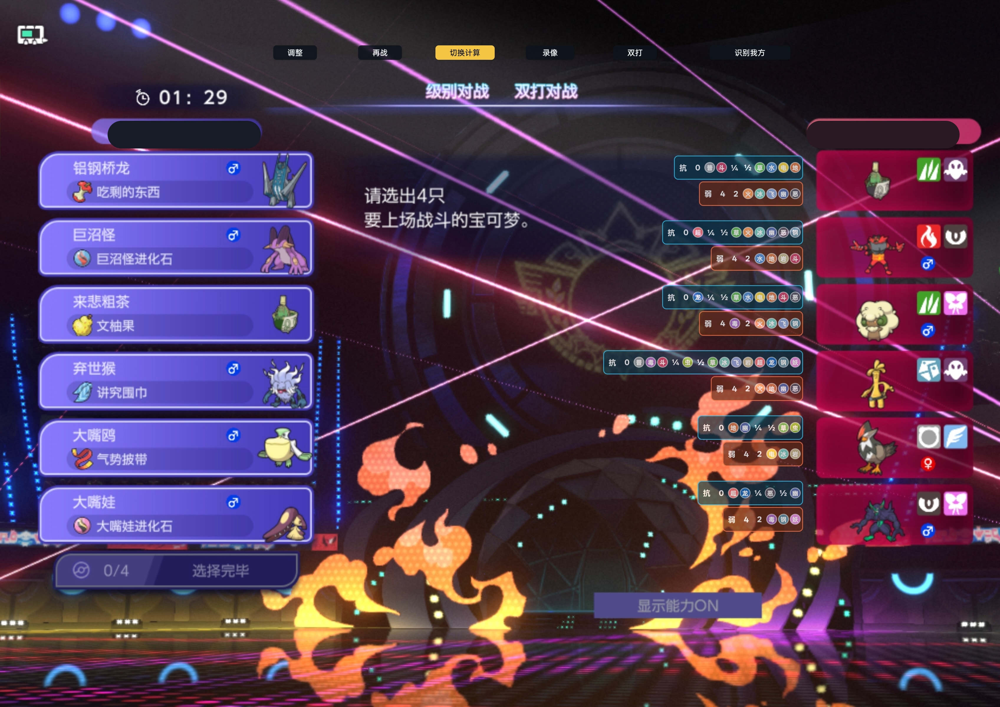

# 1.1.8 发布说明（Android / HarmonyOS）

发布日期：2026-08-09

版本：`1.1.8 (13)`

正式版标签：`v1.1.8`

对应源码：

- Android 标准版：`main`，构建提交 `d0d1f7de5d5abadc5de5a87492f7b0d875f7019f`
- Android 录屏功能版：`feature/battle-replay-phase-4`，构建提交 `61ba09bd8e9b1cc8c8447cbdc3cf891b622645ab`
- HarmonyOS 标准版与录屏功能版：`feature/harmonyos-port`，构建提交 `a520ab3c334e4e064da4bf9dd5504aa1b1a0120f`

`v1.1.7` 发布后合入属性相性 HUD、对局间状态复位和游戏视口映射改进，因此本次递增为 `v1.1.8`，不移动或覆盖已经公开的旧标签。

> **HarmonyOS 重要提醒：本次 HarmonyOS 标准版和录屏功能版仍未经过真实设备安装、升级或功能测试。**
> 当前证据只覆盖源码/逻辑测试、Release 构建、包结构、变体隔离与签名验签。浮窗、跨应用截屏、OCR、录屏、内部音频、相册写入、权限拒绝/撤销、横竖屏、后台恢复和覆盖升级必须以 HarmonyOS ARM64 真机结果为准。

## 下载选择

| 平台 | 版本 | 文件 | 适用场景 |
| --- | --- | --- | --- |
| Android | 标准版（推荐） | `Pokemon-Champions-Assistant-v1.1.8-arm64.apk` | 队伍识别、伤害计算、传统悬浮面板和战斗 HUD |
| Android | 录屏功能版（可选） | `Pokemon-Champions-Assistant-v1.1.8-replay-arm64.apk` | 在标准能力之外，还需要保存本机 MP4 |
| HarmonyOS | 标准版（预览） | `Pokemon-Champions-Assistant-v1.1.8-harmonyos-standard.hap` | HarmonyOS 标准助手能力；未经过实机测试 |
| HarmonyOS | 录屏功能版（预览） | `Pokemon-Champions-Assistant-v1.1.8-harmonyos-replay.hap` | HarmonyOS 助手与录屏能力；未经过实机测试 |

Android 两个 APK 都只包含 `arm64-v8a`，使用同一应用 ID、版本号和生产签名，可互相覆盖并保留应用数据，但不能同时安装。`x86_64` APK 已完成本地构建校验，仅用于 Android Studio 模拟器，不上传 GitHub Release。

HarmonyOS 两个 HAP 是包含 `arm64-v8a` 与 `x86_64` Native 库的签名通用包，使用同一 bundle、版本号和项目发布证书。该本地 Release Provision Profile 不代表应用市场审核通过，也不保证所有商业 HarmonyOS 设备接受安装。

## 文件校验

- Android 标准版：`71,410,954` 字节；SHA-256：`B4726C1EDABC66DD224584225D34253E15A3EBEDBBF86231EF8C8CDF7F2BB749`
- Android 录屏功能版：`71,574,846` 字节；SHA-256：`91BE187750D912F98B2069F78DB9F80D1EA04A858977C25B8F16D802E64EEE83`
- HarmonyOS 标准版：`39,242,187` 字节；SHA-256：`849BD8679F4BA5E89B555F55402292F5936ABBB1D0169323D519A4283E0E3973`
- HarmonyOS 录屏功能版：`39,367,756` 字节；SHA-256：`1A0B05CC66052C52F7AF160FA5B05AF0351E70A7D69D8570DE07E5D8C56AB3CC`

Android 生产签名证书 SHA-256：
`671B45190A9DAC81A2747355CB9F10703503F1302EAF3E59582A282DD827EEF8`

HarmonyOS 项目发布证书 SHA-256：
`087C36F8FBCAB8EAE749E01BA11D9312D1C7347547D5548FDC32E40E56DB55FB`

## 1.1.8 变化

### 属性相性 HUD

- 确认双方阵容后，战斗 HUD 先显示对方六只宝可梦的属性抗性、免疫、弱点与倍率，帮助在选人阶段快速检查打点。
- 属性图标按每行实际数量自动分列，单属性、双属性和多种倍率都保持固定大小与对齐，不因图标数量变化挤压到宝可梦卡片。
- 顶部按钮按“切换计算 → 隐藏 HUD → 显示 HUD”循环；从隐藏状态恢复时重新回到属性相性页。

  

该图于发布当天从物理 Android 手机相册的第一张图片提取。原始 MediaStore ID 为 `1000012630`，原始文件为 `3,494,777` 字节、SHA-256 `257A155AA8C37F3F149186714DEE8DE2247A782A173CBBAF6A52D9AA69683791`。公开文档图只对双方游戏昵称做隐私遮挡，HUD 与其余画面保持不变；文档资产为 `960,530` 字节、SHA-256 `98493FD794A19204EA8BC413DDF8BEA13D0FDEBEA54369AD283EBCB4DA2BA66D`。

### 对局复位与布局映射

- 开始新一局、再次识别或切换 HUD 阶段时会清理上一局的临时显示状态，避免属性相性页、伤害选择和隐藏状态串到下一场。
- Android 与 HarmonyOS 都按游戏内容区域而不是整块物理屏幕定位属性相性 HUD；在宽屏、黑边和不同安全区域下使用居中的最大 `16:9` 游戏视口。
- 标准版、录屏功能版与 HarmonyOS 保持相同的显示循环、对局复位和视口映射语义，同时保留各自的录屏功能边界。

## 验证结果

### Android

- 标准版：Node/TypeScript 回归 `11/11`、Android JVM `124/124` 通过。
- 录屏功能版：Node/TypeScript 回归 `11/11`、Android JVM `159/159` 通过。
- 两个分支的 `lintRelease`、第三方许可证、生产签名、版本、变体身份、识别特征包、许可证资源、更新专用网络权限及 ARM64/x86_64 单 ABI Release 校验通过。
- 两个分支的 `npm.cmd audit --omit=dev --audit-level=high` 均为 `0 vulnerabilities`。
- 录屏功能版 ARM64 APK 已在物理 `RMX3820`（ADB `6465e08`）从 `1.1.7 (12)` 原地覆盖升级到 `1.1.8 (13)`；安装返回 `Success`，设备内 `base.apk` 与本地产物 SHA-256 均为 `91BE187750D912F98B2069F78DB9F80D1EA04A858977C25B8F16D802E64EEE83`，`MainActivity` 冷启动成功。
- 标准版本轮完成签名包级与本地构建验证，但没有再覆盖手机上已经验证的录屏版，因此不把标准版写成独立真机 PASS。

### HarmonyOS

- 标准版与录屏功能版均完成 Release 类型检查、ArkTS/Native 构建、HAP 签名和独立验签。
- 包级验证确认版本 `1.1.8 (13)`、同一 bundle/证书、预期页面与资源、标准/回放变体隔离，以及 `arm64-v8a,x86_64` ABI 集合。
- 综合测试共 84 项，82 项通过；旧的 220 项审计证据锁因产品文件与版本发生变化而按设计失败，x86 Native 预览测试因未连接 `127.0.0.1:5557` 模拟器而失败。
- 当前没有 E5 ARM64 HarmonyOS 真机证据，不能据此声称安装、权限、截屏/OCR、浮窗、录屏、属性相性 HUD 或横竖屏恢复已经真机通过。

## 升级与反馈

- Android 用户可在应用“设置 → 检查更新”中打开本 Release，或直接下载与当前需求匹配的 ARM64 APK。请勿安装本地 x86_64 模拟器包。
- 标准版与录屏功能版使用同一应用 ID、`versionCode=13` 和生产签名，可互相覆盖并保留本地队伍、对局与设置；重要数据仍建议先在设置中导出 JSON 备份。
- HarmonyOS 用户请把 HAP 文件名、设备型号、系统版本、CPU 架构、安装错误文本或可脱敏日志一并反馈；不要上传真实队伍截图、令牌、签名材料或个人备份。
- 项目是本地辅助工具，不修改、注入或 Hook 游戏进程，不读取游戏内存，不拦截网络，也不自动操作游戏。

## 已知边界

- 本轮 Android 真机证据覆盖录屏功能版的安装、版本、设备内 APK 哈希和冷启动，不代表所有识别、HUD、录屏或长时运行路径都已自动化验收。
- HarmonyOS 两个版本均未经过真实设备安装、升级或功能测试；包级验签不等于设备可安装，也不等于跨应用截屏、OCR、浮窗、录屏或属性相性 HUD 可用。
- 自动识别结果仍必须由用户确认；伤害结果取决于当前填写的能力值、招式、特性、道具、场地和状态。
